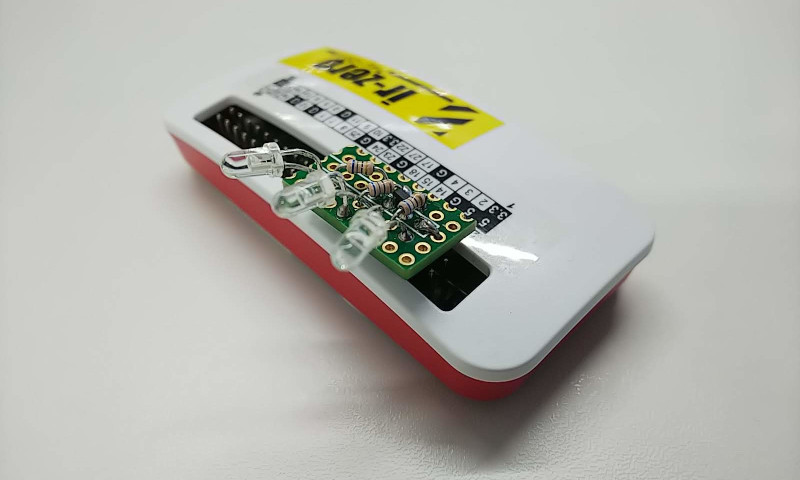

# piirremcon
Respberry Pi IR remote controller

## What's this?

This software make Raspberry Pi a universal IR remote controller
for appliances.

ラズベリーパイで赤外線リモコンを実現します。学習リモコンではないので
赤外線 LED を取り付けるだけです。

## Features

  - No special library (libc 等の標準ライブラリのみで書かれています。極端なことを言うと、Raspberry pi以外の UN*X 系 OS であればコンパイルが通ります。)

## How to use

### circuit

  - IR LED is controlled by BCM #14 (#8 of 40) pin.  You can cnange it 
    by editing `#define IR_LED 14` in `piirremcon.c`. (赤外LEDは
	Raspberry Pi の BCM 14番 (40Pの番号で8番) で制御します。
    active high です。
	
  - The simplest connection is something like `BCM14(#8)--- A>K ---[68 ohm]--GND(#6 of 40)`. (一番単純な接続続方法は`BCM14(8番ピン)--- A>K ---[68 ohm]--GND(6番ピン)`です。)
  
  - If you need more power, you can make amplifier circuit like the picture in this page. (光量が必要なときは写真のような増幅回路を作ると良いと思います。)


### command line tool

```shell-session
$./piirremcon sharptv power
```

## Working targets (See `piirremcon.h`.)

  - SHARP TV (Aquos)
  - SONY TV (BRAVIA)
  - TOSHIBA TV (REGZA)
  - NEC projector
  - EPSON projector
  - SONY Blu-ray player
  - Panasonic room light


